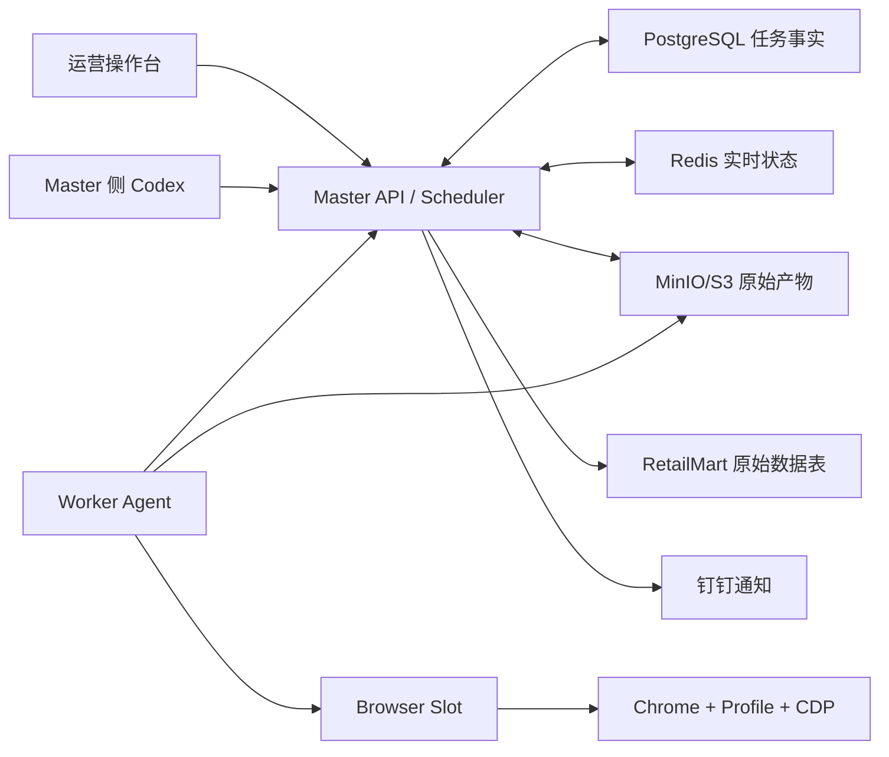

# 系统架构与数据流

## 总体架构



## 组件职责

### Master

- Worker、账号、Profile、Browser Slot 和门店登记。
- 门店批次和固定类目任务规划。
- fenced lease、进度、暂停、恢复和迁移。
- 风险事件、截图和人工处理。
- artifact、质量结果、导出和入库编排。
- 为 Codex 提供白名单巡检与幂等操作。

PostgreSQL 是任务事实源。Redis 只承载实时状态和事件，不得成为唯一任务事实。

### Worker

- 主动连接 Master 并报告心跳。
- 管理本机 Browser Slot 和可见 Chrome。
- 执行固定任务和低频采集。
- 本地追加写 raw JSONL 与 checkpoint。
- Master 暂时不可用时写入本地 spool。
- 上传原始数据、截图、summary、日志和质量结果。

Worker 不做全局调度，不直接访问 Master 数据库。

### Browser Slot

稳定绑定链：

```text
Worker
  -> Browser Slot
  -> Profile
  -> Login Account
  -> CDP Endpoint
  -> Target Store
  -> Active Category Task
```

`slot_id` 是业务身份；CDP 端口只是运行属性。

### Codex

- 理解复杂异常和页面结构变化。
- 巡检停滞、风险、离线和数据差异。
- 调用 Master 白名单动作。
- 生成诊断和修复建议。

Codex 不持有任务租约，不直接写生产业务表，不通过批量 SSH 代替调度。

## 数据流

```text
页面运行时与响应
  -> Worker 本地 raw JSONL + checkpoint
  -> MinIO/S3 精确对象版本
  -> PostgreSQL 结构化 SPU/SKU 与质量结果
  -> RetailMart 原始事实表
  -> Excel/下游业务投影
```

任何投影都可以从原始层重建；原始层不能由投影反向补写。
