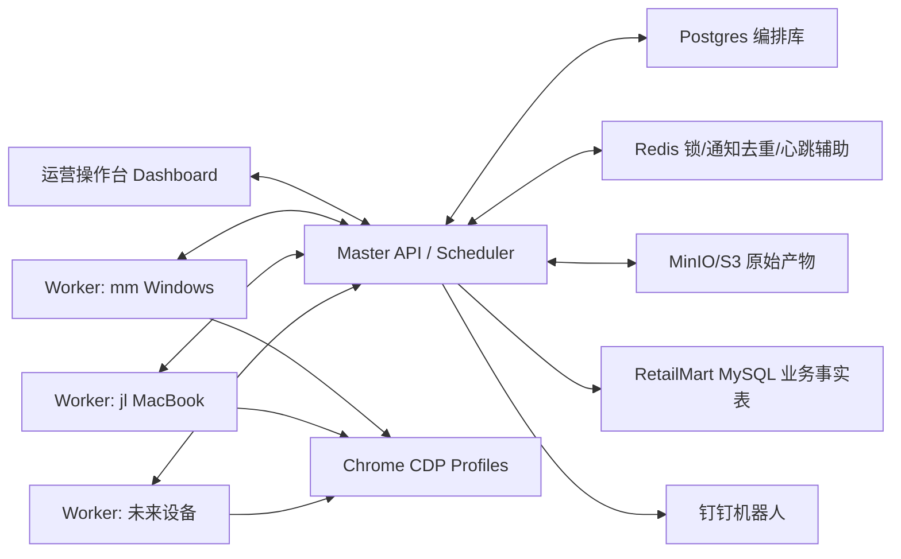
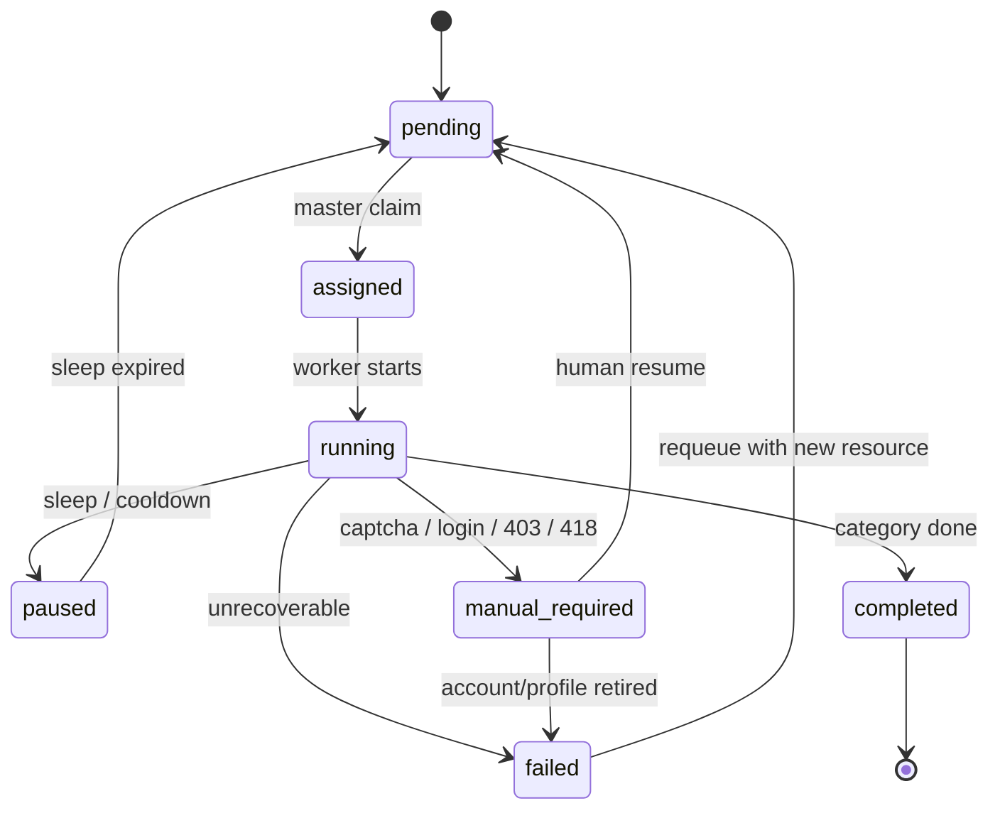

# Retail-Radar 生产级架构文档

更新时间：2026-07-09

## 1. 系统定位

Retail-Radar 不是爬虫脚本，而是一个面向运营的数据生产系统。它负责长期、低频、可暂停、可人工介入地采集即时零售竞对门店前端商品价格，并保证每一条数据可追溯到采集设备、账号、Profile、CDP、任务、原始产物和质量检查。

系统必须优先解决以下生产问题：

- 多设备、多账号、多 Profile 的绑定关系不可混淆。
- 风控、验证码、登录异常出现时可以暂停、通知、人工处理、恢复。
- 多门店并行时不能错账号采错门店。
- 数据必须 raw-first，不能只保留清洗后的业务表。
- 用户到手价是核心业务字段，必须纳入采集与质量检查。
- 系统可扩展到 30 个账号、10 台设备、20 个门店，不依赖人工盯浏览器。

## 2. 第一性原理

采集生产系统的核心不是“请求更多”，而是“在资源约束下稳定产出可信数据”。

因此系统设计遵循：

1. 资源可识别：账号、Profile、CDP、设备、门店必须唯一绑定。
2. 任务可控：每个类目任务有状态机、lease、checkpoint。
3. 风险可闭环：验证码、403、418、封号必须进入风险事件队列。
4. 数据可追溯：业务数据必须能回溯 raw artifact。
5. 质量可度量：前端展示价、用户到手价、SKU 完整度必须被统计。
6. 操作可审计：人工暂停、恢复、换号、下线 Profile 都必须留痕。
7. 扩展可水平化：新增设备和账号只增加 worker 与资源池，不改调度内核。

## 3. 总体架构



职责边界：

- Master：资源注册、任务调度、风险事件、数据资产、质量检查、生产就绪检查、告警。
- Worker：本机 CDP/Profile 执行、采集脚本运行、心跳、截图、artifact 上传、进度回报。
- Dashboard：运营操作台，不直接采集数据。
- MinIO/S3：保存 raw JSONL、日志、截图、checkpoint、summary。
- RetailMart MySQL：只保存业务确认后的 `fact_store_sku_price_snapshot`，不保存完整 raw。

## 4. 账号/Profile/CDP 绑定模型

标准绑定链路：

```text
Worker 设备
  -> CDP Endpoint
    -> Chrome Profile
      -> 登录账号
        -> 目标门店
          -> 当前类目任务
```

生产约束：

- 一个账号固定一个 Profile。
- 一个 Profile 不得跨账号复用。
- 触发风险的 Profile 不得登录新账号。
- 一个 CDP 同一时刻只能执行一个任务。
- CDP 标识页必须维护：端口、账号槽位、脱敏手机号、归属人、目标门店。
- 手机号/归属人/目标门店缺失时，生产就绪检查必须阻断。
- `test/debug/demo/default` 等标识不得出现在生产资源中。

当前两门店六账号计划：

| 门店 | Worker/CDP | 账号槽位 |
|---|---|---|
| 乐购达景耀店 | mm `9301/9302/9303` | `LIGOUDA-JINGYAO-A01/A02/A03` |
| 呱呱超市莲湖店 | jl tunnel `19304/19305/19306` | `GUAGUA-LIANHU-A01/A02/A03` |

## 5. 任务状态机



任务必须包含：

- `run_id`
- `store_id`
- `category_name`
- `assigned_worker_id`
- `assigned_account_id`
- `assigned_profile_id`
- `assigned_cdp_endpoint_id`
- `lease_owner`
- `lease_until`
- `cursor`
- `checkpoint_artifact_id`
- `raw_artifact_id`
- `summary_artifact_id`
- `collected_items`
- `last_error`

关键规则：

- worker 领取任务时使用 DB row lock + `FOR UPDATE SKIP LOCKED`。
- 任务 lease 超时自动回收为 `pending`，保留 checkpoint。
- 同一个 CDP 不允许同时绑定多个 `assigned/running` 任务。
- 多门店活跃任务中，未绑定资源的 pending 任务禁止开采。
- 恢复任务必须从 checkpoint/页面自然状态恢复，不从深分页硬打。

## 6. 风控事件闭环

风控事件类型：

- `captcha`
- `identity_check`
- `login_required`
- `interface_403`
- `interface_418`
- `account_blocked`
- `profile_risk`
- `device_risk`

事件必须包含：

- worker
- account
- profile
- cdp port
- store
- category
- phase
- observed
- recommended_action
- screenshot artifact
- error JSON/log artifact

闭环动作：

- 确认风险。
- 标记已解决。
- 任务休眠 2 小时。
- 恢复任务。
- 重新排队。
- 标记账号封控。
- 标记 Profile 污染。
- 停用 Profile/CDP。
- 标记设备/IP 观察。

验证码策略：

- 系统不绕过验证码。
- worker 检测后把任务改为 `manual_required`。
- 钉钉通知人工处理。
- 人工处理后从操作台恢复任务。
- 如果验证失效或账号封控，换账号和新 Profile。

## 7. 数据资产链路

数据分三层：

1. 原始层：raw JSONL、截图、日志、checkpoint、summary，保存在 MinIO/S3。
2. 结构化层：`product_snapshots`、`sku_snapshots`，保留字段和 raw JSON。
3. 业务层：`fact_store_sku_price_snapshot`，只保存业务可用的清洗后 SKU 价格事实。

采集阶段必须保留完整信息，不在采集过程中做业务裁剪。

必须采集或保留的价格字段：

- 前端展示价文本。
- 前端展示价数值。
- 用户到手价文本。
- 用户到手价数值。
- 原价/划线价。
- 促销说明。
- 价格来源路径。
- SKU 价格。
- SPU 价格。
- raw JSON。

质量检查指标：

- raw rows。
- unique SPU count。
- SKU rows。
- front display price coverage。
- user final price coverage。
- promotion info coverage。
- duplicate SPU count。
- completeness status：`pass/warn/fail`。

到手价覆盖率低于阈值时，不允许直接交付业务。

## 8. 生产就绪检查

开采前必须调用 `/api/production-readiness`。

检查项：

- 预期 worker 是否存在且在线。
- 账号数量是否符合本轮计划。
- CDP 数量是否符合本轮计划。
- 是否存在 `test/debug/demo/default` 残留。
- 是否存在风险账号。
- 是否存在风险 Profile。
- 是否存在手机号/归属人/目标门店缺失。
- 是否存在重复账号、重复 Profile、重复手机号、重复 CDP。
- 是否存在同一 CDP 多个运行任务。
- 是否存在多门店未绑定资源任务。
- 是否存在高危未解决风险。
- worker token 是否仍为默认值。

结论：

- `ready`：允许登录并准备开采。
- `warning`：可继续，但需要人工确认。
- `blocked`：禁止开采。

## 9. 监控告警

钉钉只发送有效通知：

- 高危风险事件。
- 验证码/身份核验。
- 403/418。
- worker 离线。
- 任务长时间无进度。
- 门店进度 50%。
- 门店完成 100%。
- 原始产物上传失败。
- 到手价覆盖率异常。

通知必须包含：

- 设备。
- CDP。
- 账号脱敏手机号。
- 目标门店。
- 当前类目。
- 异常类型。
- 处理动作。

避免每请求一次就通知。

## 10. 操作台 UI

核心页面：

1. 作战指挥大盘：全局进度、生产就绪检查、风险待办、实时事件。
2. 资源拓扑：worker -> CDP -> Profile -> account -> store。
3. 调度与批次：门店、run、类目任务、分配状态。
4. 风控干预台：风险队列、截图、日志、恢复/休眠/换号动作。
5. 数据资产：raw artifact、质量检查、结构化快照、导出产物。

UI 原则：

- 所有关键状态用中文展示。
- 账号只显示脱敏手机号。
- CDP 端口、目标门店、归属人必须醒目。
- 操作按钮必须可审计。
- 不用 demo/test 文案。

## 11. 30 账号、10 设备、20 门店扩展模型

资源池：

- Account Pool：`safe/running/cooldown/manual_required/account_blocked/retired`
- Profile Pool：`safe/profile_risk/retired`
- Worker Pool：`online/offline/degraded/device_risk`
- Store Pool：`active/paused/retired`
- CDP Pool：`ready/running/manual_required/login_required/profile_risk/retired`

扩展策略：

- Master 不关心 worker 在哪台机器，只认 worker heartbeat 和能力。
- 新设备只需要启动 worker 并登记账号/CDP。
- 门店任务按类目切片。
- 账号按门店分组，避免跨门店串用。
- 调度使用 lease 和资源约束，避免并发冲突。
- 所有数据产物按 run/store/task/account/profile 分区归档。

## 12. 长期维护策略

每日/每次开采前：

- 跑 production readiness。
- 确认账号池健康。
- 确认 Profile 无风险。
- 确认 worker 在线。
- 确认目标门店和账号分配。
- 确认钉钉 webhook 可用。

每次开采后：

- 检查 raw artifact。
- 检查价格质量。
- 检查到手价覆盖率。
- 导出业务 Excel/CSV。
- 写入 `fact_store_sku_price_snapshot`。
- 归档风险事件和操作记录。

每周：

- 复盘账号风控。
- 标记冷却/废弃账号。
- 清理旧 planned run。
- 核对门店列表和账号归属。
- 更新技能库和 runbook。

## 13. 当前实现状态

已实现：

- master-worker 心跳。
- CDP/Profile 启动和标识页。
- 账号/Profile/CDP 注册。
- 任务 lease 和自动回收。
- 风险事件与钉钉通知。
- artifact presign 和 metadata registry。
- product/sku snapshot。
- price quality check。
- production readiness。
- dashboard 资源拓扑、风险干预、数据资产、生产就绪面板。
- worker token 鉴权。

仍需继续完善：

- 操作审计日志。
- run 级别完整详情页。
- MySQL `fact_store_sku_price_snapshot` 写入作业。
- 截图 artifact 与风险事件更深绑定。
- 账号冷却日历和 D+1 风控复盘。
- 采集后业务 Excel 自动生成。

